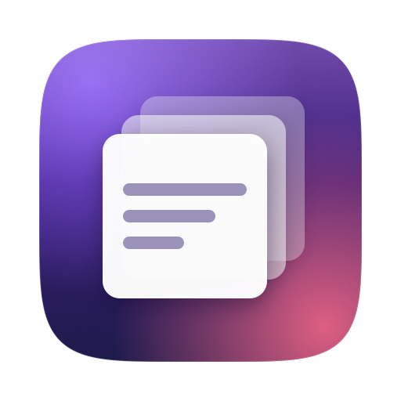

<div align="center">



# Clipboard Overlay

**A Spotlight-style clipboard history for macOS, and nothing else.**

Press `Cmd+Shift+V` anywhere · type to filter · hit Enter · it pastes itself.

No dock icon. No menu bar icon. No settings. Invisible until you summon it.

</div>


> **The GIF isn't recorded yet** — it needs a real screen recording. See
> [Recording the demo](#recording-the-demo).

## Install

Requires macOS 13+. No Xcode needed — Command Line Tools are enough.

```sh
git clone https://github.com/USERNAME/clipboard-overlay.git
cd clipboard-overlay
./install.sh
```

That builds it, installs it to `/Applications`, and starts it. Nothing will
appear on screen — that's correct. Press `Cmd+Shift+V`.

<details>
<summary>Why build from source instead of downloading a binary?</summary>

The app is ad-hoc signed rather than notarized (notarizing needs a paid Apple
Developer account). macOS quarantines anything unsigned you download, so a
prebuilt `.app` would greet you with *"can't be opened because Apple cannot
check it for malicious software"* and need a `xattr` incantation to run.

Built on your own machine, none of that applies — it just runs. There are zips
on the [releases page](../../releases) if you'd rather, with the workaround
documented there.

</details>

### Grant Accessibility (for auto-paste)

macOS won't let any app synthesize the `Cmd+V` keystroke without permission. The
first time you press Enter on a clip, you'll get the system prompt — approve it
under **System Settings → Privacy & Security → Accessibility**.

Without it everything still works, except the last step: the clip lands on your
clipboard and you press `Cmd+V` yourself.

### Start it at login

**System Settings → General → Login Items → `+` → ClipboardOverlay**

## Use

| Key | Action |
| --- | --- |
| `Cmd+Shift+V` | Show / hide the overlay |
| *type* | Filter clips (fuzzy — `hw` matches `hello world`) |
| `↑` `↓` | Move selection |
| `Enter` | Paste the selected clip into the app you came from |
| `Esc` | Dismiss |

Clicking outside dismisses it too. The mouse is never required.

## Why an overlay and not a menu bar app

Most clipboard managers are a full app wearing a clipboard costume: a menu bar
icon, a preferences window, a pinned-items pane, sync. But the actual job — *"I
copied something three copies ago and I want it back"* — lasts about two seconds
and happens in the middle of typing. Every piece of permanent UI is a thing you
look at all day for a feature you use for two seconds at a time.

So this is scoped to one hotkey and one panel. It has no persistent surface to
maintain, nothing to configure, and nothing to notice when you aren't using it.
The overlay *is* the product. That constraint is also what keeps it fast: there's
no app shell to wake up, just a panel that's already built, waiting for a
keystroke.

## How it works

| File | Role |
| --- | --- |
| `main.swift` | Entry point; sets `.accessory` so there's no dock icon |
| `AppDelegate.swift` | Wires watcher → history → hotkey → overlay → paste |
| `ClipboardWatcher.swift` | Polls `NSPasteboard.changeCount` every 0.5s |
| `ClipItem.swift` | One clip (text or PNG) + preview/fingerprint |
| `ClipboardHistory.swift` | Capped, de-duplicated, newest-first, persisted |
| `FuzzyMatch.swift` | Subsequence matching + ranking |
| `GlobalHotKey.swift` | Carbon `RegisterEventHotKey` |
| `OverlayController.swift` | The panel, the focus dance, key handling |
| `OverlayView.swift` | The SwiftUI list |
| `Paster.swift` | Pasteboard write + synthesized `Cmd+V` |

A few decisions worth knowing about:

**Focus is the hard part.** The panel is a `.nonactivatingPanel`, but macOS only
routes keystrokes to the frontmost app — so type-to-filter *requires* activating.
The overlay records whoever was frontmost before it appears, hands focus straight
back on dismiss, then waits for that app to actually be active before pasting
(polling, not a guessed `sleep`). That's what makes the paste land in the right
place.

**Carbon, not `NSEvent` monitors.** `RegisterEventHotKey` needs no permissions; a
global `NSEvent` monitor would demand Accessibility just to notice the hotkey.

**Passwords are skipped.** Clips marked with the `org.nspasteboard.ConcealedType`
convention — what password managers set — are never recorded.

**Your own paste flows back through the watcher on purpose.** Re-pasting an old
clip makes it current, so it naturally returns to the top of the list.

## Storage

`~/Library/Application Support/ClipboardOverlay/history.json`, `0600`, last 100
clips. Delete it to wipe your history. Images over 512KB stay in memory for the
session but aren't written to disk, so a few screenshots can't balloon the file.

## Develop

```sh
./build.sh debug     # build (release is the default)
./run-tests.sh       # self-test
swift Tools/make-icon.swift && iconutil -c icns build/AppIcon.iconset -o Resources/AppIcon.icns
```

`run-tests.sh` drives the real overlay with real key events in-process (no
Accessibility needed) and checks focus, filtering, navigation, selection, and the
pasteboard write. It uses a throwaway history file and restores your clipboard
afterwards. The self-test is compiled out of release builds.

Not covered automatically: the synthesized `Cmd+V` and the physical hotkey — both
need permissions a test driver can't grant itself.

## Recording the demo

Screen-record `Cmd+Shift+V` → type → `Enter` landing in a text editor, then:

```sh
ffmpeg -i demo.mov -vf "fps=20,scale=760:-1:flags=lanczos" -loop 0 docs/demo.gif
```

## Deliberately not built

No menu bar icon, no dock icon, no settings, no preferences, no onboarding, no
cloud sync, no database, no pinned clips, no configurable hotkey. Each one is a
"maybe later," not a v1.

## License

[MIT](LICENSE)
